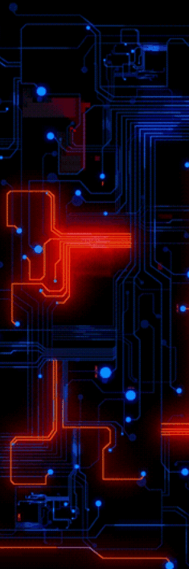

<h1 align='center'>Welcome for my profile </h1>

<h2 align='center'> Hi, I'm Miguel and I'm student of front end 🚀</h2>

 

 
 
 
 

 <h2 align='center'> 🛠 Tech Stack</h2>
 
&nbsp;
&nbsp;
&nbsp;
&nbsp;
&nbsp;
&nbsp;
&nbsp;
 
